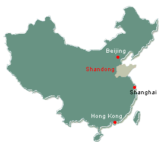

## Hi there 👋, I'm Qingfang Liu (刘晴方) 

Welcome to my GitHub! 🚀 

🌏 Born and raised in **Shandong, China**, now exploring the world from **Baltimore, MD**.  
🎯 Passionate about **data science, neuroscience, and solving real-world problems** with **AI & analytics**.

## 💡 About Me

- 🏗 **Actively building** my career in **data science**, with a focus on **healthcare**.  
- ⚡ **Currently learning** PySpark to supercharge **brain imaging data analysis**.  
- 🤝 **Open to collaborating** on **LeetCode, ML projects, and industry applications**.  
- 🎯 **Looking for** connections in **industry hiring, resume reviews, and mock interviews**.

## 💬 Fun Facts About Me:
- ☕ Can’t function without **coffee** in the morning.  
- 🚴 Loves **BodyPump & sprint cycling**—work hard, sweat harder!  
- 📚 Enjoys reading **biographies & tech innovations**.  
- 🔍 Always **curious** and on the lookout for **new challenges**.  

---

### 💌 Let's Connect!
🔗 [LinkedIn](https://www.linkedin.com/in/qingfang-liu/) | 📫 Reach me at: psychliuqf@gmail.com

